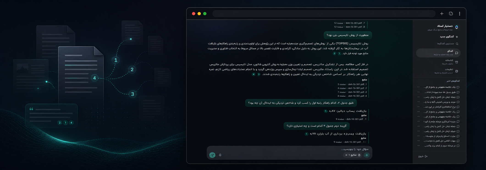
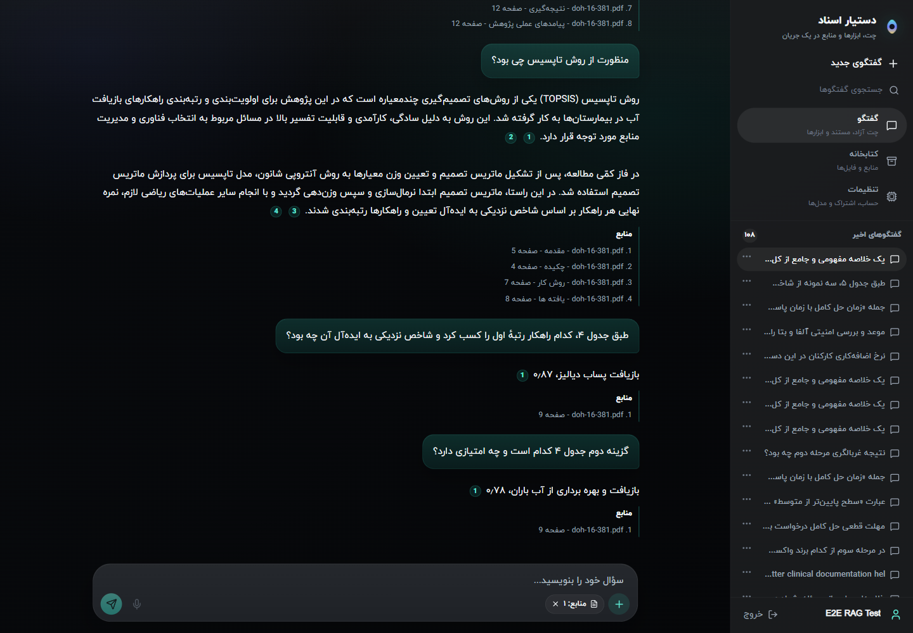
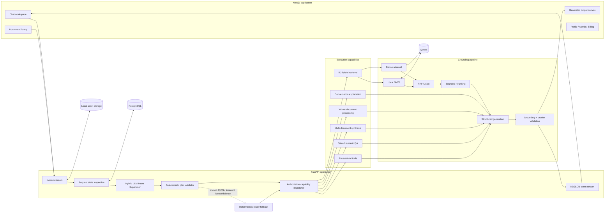

# Dastyar Asnad

<p align="center">
  
</p>

<h3 align="center">A multilingual, evidence-first workspace for understanding private documents</h3>

<p align="center">
  Upload documents, ask grounded questions, summarize and compare sources, inspect tables, continue the conversation, and turn source material into practical learning and writing tools.
</p>

<p align="center">
  
  
  
  
  
  
</p>

> [!IMPORTANT]
> This repository is a serious engineering portfolio project under active development, not a claim of turnkey production readiness. Its core document conversation path, evaluation framework, and regression suite are operational. Public deployment still requires environment-specific security hardening, backups, monitoring, data-retention policies, and infrastructure review.

---

## What this project is

Dastyar Asnad is a Persian-first, multilingual document intelligence application built around a grounded Retrieval-Augmented Generation pipeline. It combines a polished chat workspace with page-aware document processing, semantic intent supervision, hybrid retrieval, bounded generation, citation validation, conversation memory, reusable AI tools, and a reproducible quality-evaluation system.

The project is designed around a simple rule:

> A useful answer is not enough. The system should know which capability to run, use the right evidence, preserve document and page provenance, and expose uncertainty instead of inventing facts.

It is not a thin chat wrapper. The repository includes the complete application surface: authentication, user-scoped document storage, background ingestion, PostgreSQL persistence, Qdrant indexing, multi-turn conversations, streaming responses, generated outputs, exam grading, subscriptions, administration, usage accounting, evaluation datasets, deterministic metrics, and browser tests.

## Product capabilities

### Grounded document intelligence

- Document question answering over one or several selected assets
- Fit-aware, whole-document summaries for a single document
- Multi-document summaries with per-document coverage and a final synthesis
- Multi-document comparison across goals, methods, evidence, findings, and limitations
- Table, ranking, numeric, section, and physical-page questions
- Quoted-text explanation that remains document-grounded
- Cross-language retrieval between Persian and English
- Conversation-only explanations such as “explain your previous answer more simply”
- Explicit no-answer behavior when the selected evidence is insufficient
- Page-aware citations linked to the originating document
- Streaming execution states that describe only stages that actually ran

### Document workspace

- Upload and process `PDF`, `DOCX`, and `TXT`
- Select one or multiple assets for a request
- Browse a user-scoped document library
- Persist, search, rename, and delete conversations
- Reuse the selected conversation and asset context across follow-up turns
- Open structured outputs in an interactive side canvas
- Keep generated outputs connected to their conversation and source assets

### AI tools

The tool system is available through the chat composer and a parameter-aware tool picker. Every tool has a server-side definition, validation schema, source policy, output type, and usage context.

| Tool | Current behavior | Stage |
|---|---|---|
| Document summary | Short, medium, or detailed; bullet or paragraph output | Available |
| Key-point extraction | Extracts a configurable number of prioritized points with an optional focus | Available |
| Document comparison | Compares selected sources and reports similarities, differences, and conflicts | Available |
| Exam generator | Builds structured mixed-format exams from selected documents | Active development |
| Flashcards | Produces configurable question/answer cards for review | Active development |
| Article draft | Creates a structured draft with audience, tone, and length controls | Active development |
| Legal pleading draft | Produces a cautious, structured first draft from user input and optional sources | Experimental |
| Legal review | Reviews structure, citations, language, and ambiguity | Experimental |
| Rewrite | Rewrites text with configurable tone and length | Available |

#### Exam workflow

The exam feature is more than a prompt preset:

- Requires one or more selected source documents
- Supports 1–60 questions
- Supports configurable multiple-choice and descriptive question counts
- Validates that the subtype counts equal the requested total
- Supports difficulty, duration, total score, and answer-key placement
- Produces a structured exam payload rendered in the output canvas
- Grades objective questions deterministically
- Can grade descriptive answers with a strict JSON-constrained LLM grader
- Records generation and grading usage under their own feature contexts

The exam generator and grading UX are functional development features, but still need broader classroom workflows, authoring controls, publishing, and dedicated test coverage before they should be treated as a finished assessment product.

### Product and account infrastructure

- Session-based authentication
- OTP and email/password registration/login flows
- User profiles and model preferences
- Subscription-aware API guards
- ZarinPal payment integration with sandbox support
- Admin views for users, subscriptions, payments, and basic statistics
- Provider-token and estimated-cost accounting
- Compute-operation telemetry for embedding and reranking work
- Per-user scoping for documents, conversations, outputs, and retrieval

## Product preview

The screenshot below is from the real Persian UI and demonstrates a multi-turn, table-aware conversation. The assistant explains the TOPSIS method, resolves the first-ranked strategy from Table 4, returns its closeness coefficient, then answers a follow-up about the second-ranked row—all with physical-page provenance.

<p align="center">
  
</p>

## System architecture



### Request lifecycle

```text
Authenticated request
  → conversation and selected-asset state
  → semantic intent classification
  → deterministic validation
  → capability dispatch
  → direct context or evidence retrieval
  → structured generation
  → grounding, coverage, and citation validation
  → bounded same-context repair/fallback when allowed
  → persisted message and NDJSON stream
```

There is one authoritative production dispatch path. The FastAPI endpoint and automated tests do not maintain separate production routers.

## Hybrid LLM Intent Supervisor

Every normal message is semantically classified before execution. The Supervisor sees only the request state needed for routing:

- Current user message
- A short, relevant history summary
- Previous user and assistant turns when available
- Selected asset count, IDs, and titles
- Whether quoted text is present
- Whether a previous assistant response exists
- Capabilities the application can actually execute

It returns a constrained plan rather than free-form reasoning:

```json
{
  "intent": "multi_document_comparison",
  "scope": "multiple_documents",
  "uses_history": false,
  "requires_retrieval": true,
  "target_capability": "multi_document_comparison",
  "confidence": 0.96
}
```

Supported semantic intents:

- `conversation_explanation`
- `single_document_summary`
- `multi_document_summary`
- `multi_document_comparison`
- `document_question_answering`
- `table_or_numeric_qa`
- `quoted_text_explanation`
- `section_lookup`
- `analytical_synthesis`
- `general_chat`
- `clarification_required`

The model output is never executed blindly. A deterministic validator enforces document-count, history, scope, retrieval, and capability invariants. Malformed JSON, timeouts, and low-confidence decisions fall back to the deterministic router. The Supervisor cannot choose `no_answer`; answerability is decided only after the applicable evidence path has run.

## Retrieval: R2 hybrid search

The production retrieval mode is `r2`.

1. Scope the request to the authenticated user and selected assets.
2. Embed the query with `nvidia/nemotron-3-embed-1b:free`.
3. Run dense vector search in Qdrant.
4. Run local lexical BM25 over bounded, user-scoped Qdrant payloads.
5. Fuse dense and lexical ranks with Reciprocal Rank Fusion.
6. When query and document languages differ, perform at most one retrieval-only rewrite.
7. Rerank a bounded candidate set once.
8. Diversify evidence by structural parent unit.
9. Pass immutable evidence IDs and page provenance to generation.

This gives the system exact-term sensitivity for names, numbers, tables, and quotations while retaining semantic recall for paraphrases and cross-language questions.

### Route-aware retrieval

Retrieval is not mandatory for every request:

| Request | Primary evidence path |
|---|---|
| Explanation of the previous answer | Conversation history only; zero embedding/retrieval/reranking |
| Fit-safe comprehensive summary | Complete normalized, page-aware document |
| Large-document summary | Section-aware units and bounded synthesis |
| Local factual question | R2 hybrid retrieval |
| Table or numeric question | Table/page-aware evidence inspection before refusal |
| Explicit quoted passage | Quoted-document explanation; retrieval allowed |
| Multi-document operation | Direct combined context when safe, otherwise per-document bounded summaries and synthesis |

## Document ingestion and intelligence

```text
Upload
  → extension and file validation
  → PDF / DOCX / TXT extraction
  → optional OCR fallback
  → Unicode and structural cleanup
  → canonical page-aware Markdown
  → document profile and quality gates
  → title, type, section, and administrative-role classification
  → hierarchical document map
  → heading-aware child chunks
  → embedding and Qdrant indexing
```

### Structure and provenance

- Physical PDF page markers are preserved in canonical Markdown.
- Titles, headings, tables, repeated headers, and administrative sections are classified rather than broadly deleted.
- Document maps group content into stable chapter, heading, page, or semantic units.
- Each indexed chunk retains asset, user, page, heading, parent-unit, and processing-version metadata.
- Content hashes prevent stale unit summaries from being reused after a document changes.
- Summary-unit results can be cached in PostgreSQL and remapped to current evidence IDs at runtime.

### Chunking

The active chunker is deterministic and heading-aware:

- Target size: `1,400` characters
- Hard cap: `1,900` characters
- Overlap: approximately `18%`
- Overlap never crosses a heading boundary
- Oversized blocks prefer sentence boundaries before hard splitting
- Embedded text adds concise chapter, section, subsection, and page context

## Generation, grounding, and citations

The primary grounded generator is `google/gemini-2.5-flash`; the technical/contract fallback is `z-ai/glm-5.2`.

- Generation receives immutable evidence IDs.
- Structured response parsing tolerates fenced and prefixed JSON and performs bounded repair.
- Invalid or nonexistent evidence IDs are rejected.
- Citation labels are rendered from trusted backend metadata, not model-authored source strings.
- Physical-page and document ownership are validated.
- Unsupported numeric claims and citation-only metadata evidence are tracked by evaluators.
- A technical or response-contract fallback reuses the exact same evidence context; retrieval is not repeated.
- Valid no-answer outcomes do not intentionally trigger fallback.
- Internal route names, graph nodes, parser failures, and provider names are not exposed in normal UI status text.

## Single-document and multi-document handling

### Single-document summaries

When the normalized document fits safely, the handler uses complete page-aware context in one primary generation. Larger documents use substantive section units and bounded synthesis. Administrative boilerplate—authors, publisher metadata, funding, ethics, acknowledgements, and conflicts of interest—is available for direct questions but not treated as a major summary section by default.

### Multi-document summaries

- Covers every selected asset
- Introduces and summarizes each document separately
- Preserves source identity in citations
- Finishes with a concise cross-document synthesis
- Uses direct combined context when safe
- Falls back to bounded per-document summaries before the final synthesis when required

### Multi-document comparison

The comparison handler grounds its output in the selected documents and separates:

- Topic and purpose
- Method and data
- Shared findings
- Material differences
- Conflicting claims
- Conclusions and implications
- Limitations of the available evidence

## Persistence and data model

PostgreSQL is the application database. Qdrant is the primary vector backend.

| Entity | Responsibility |
|---|---|
| Users / OTP codes | Identity, registration, verification, and account data |
| Plans / subscriptions / payments | Access and billing state |
| Assets | File metadata, processing status, profile, quality, and storage paths |
| Conversations / messages | History, streaming state, tools, citations, and output links |
| Generated outputs | Structured exams, drafts, summaries, and other reusable artifacts |
| Document unit summaries | Content-hash-aware summary cache |
| Usage events | Provider, model, tokens, latency, cost, and request context |
| Compute usage events | Embedding/reranking operation counts and local compute metadata |
| Document chunks | Legacy pgvector-compatible persistence; Qdrant remains the active vector path |

Alembic migrations define the persistent schema. The current application retains a compatibility SQL layer in `db.py`; consolidating that legacy layer is a known maintenance item.

## Safe telemetry

Production-path telemetry is designed to record execution facts without storing raw prompts or full document bodies:

- Request and runtime build IDs
- Conversation and selected-asset counts
- Supervisor and validated intents
- Target capability and fallback usage
- Graph path when applicable
- History and document-token estimates
- Embedding, retrieval, rewrite, rerank, and generation counts
- Pages, sections, and table blocks considered
- Validation status and failure codes
- User-visible streaming event IDs
- Latency, token usage, and provider cost

Credentials, cookies, provider request bodies, and full source text must not be logged.

## Evaluation and quality engineering

The repository includes a human-auditable Development Gold Set and a production-path evaluation harness rather than relying only on demos.

### Development Gold Set

- 20 source documents in the manifest
- 65 annotated single-turn tasks
- 10 annotated conversations
- 25 conversational turns
- Persian, English, and mixed-language material
- Factual, page-specific, table, numeric, summary, analytical, quoted-text, conflicting-evidence, and no-answer cases
- Graded relevance judgments and expected physical pages

Source PDFs are intentionally excluded from Git. The tracked annotations live under `evaluation/dev_goldset/`.

### Metrics

Deterministic metrics cover:

- Recall, Precision, Hit Rate, MRR, MAP, and nDCG
- Expected-page, expected-document, and evidence-set recall
- Route and retrieval-necessity accuracy
- Answer match, concept coverage, refusal, and truncation behavior
- Summary section, key-claim, conclusion, and contamination coverage
- Citation validity, document accuracy, page accuracy, and support failures
- Follow-up resolution, history use, selected-asset persistence, and unnecessary retrieval
- Strict binary Grounded Task Success
- Wilson 95% confidence intervals for proportions

### Latest documented checkpoints

| Slice | Result |
|---|---:|
| Unchanged 15-task route accuracy | `15 / 15` |
| Unchanged 15-task retrieval-necessity accuracy | `15 / 15` |
| Unchanged 15-task false refusals | `0 / 12` |
| Unchanged 15-task citation validity/document accuracy | `13 / 13` |
| Unchanged 15-task strict page accuracy | `10 / 13` |
| Unchanged 15-task strict GTS | `12 / 15` |
| Expanded 26-task route accuracy | `25 / 26` |
| Expanded 26-task retrieval necessity | `25 / 25` |
| Expanded 26-task acceptable answer | `19 / 26` |
| Expanded 26-task strict GTS | `7 / 26` |
| Cross-language Recall@10 | `1.0000` on 2 tasks |

These are development-set checkpoints, not broad production benchmarks. The expanded set intentionally reveals remaining generalization, page-selection, and latency limitations.

### Test status at the current release checkpoint

- Backend: `224 passed, 8 subtests passed`
- Frontend lint: passed
- Frontend production build: passed
- Normal Playwright E2E: `1 passed, 2 provider-backed tests skipped`
- Ordinary backend tests block non-local network access

## Technology stack

| Layer | Technology |
|---|---|
| Web application | Next.js 16, React 19, TypeScript |
| API | FastAPI, Uvicorn, Python |
| Orchestration | LangGraph plus authoritative capability dispatch |
| Semantic routing | Low-cost LLM Supervisor plus deterministic validator |
| Application database | PostgreSQL, SQLAlchemy, Alembic |
| Vector database | Qdrant |
| Dense embedding | OpenRouter / `nvidia/nemotron-3-embed-1b:free` |
| Lexical retrieval | Local BM25 over bounded Qdrant payloads |
| Fusion | Reciprocal Rank Fusion |
| Reranking | OpenRouter / `nvidia/llama-nemotron-rerank-vl-1b-v2:free` |
| Primary generation | `google/gemini-2.5-flash` |
| Generation fallback | `z-ai/glm-5.2` |
| Intent classification | `google/gemini-2.5-flash-lite` by default |
| Parsing | pypdf, python-docx |
| OCR fallback | PDFium, Tesseract, Pillow |
| Testing | pytest, Playwright, ESLint, Next.js build |
| Optional evaluation | pytrec-eval-terrier, DeepEval |

Provider adapters also exist for LiteLLM, Gemini, and Ollama, but those adapters are not the default grounded production route.

## Repository layout

```text
rag-system/
├── apps/web/                    # Next.js UI and Playwright tests
├── backend/app/
│   ├── agents/                  # Supervisor, deterministic router, LangGraph handlers
│   ├── api/                     # Auth, chat, assets, tools, outputs, billing, admin
│   ├── generation/              # Structured primary/fallback orchestration
│   ├── grounding/               # Citation contracts and validation
│   ├── retrieval/               # Hybrid search and R2 retrieval
│   └── vector/                  # Embedding, reranking, Qdrant and pgvector adapters
├── document_pipeline/           # Extraction, OCR, profiling, document maps, chunking
├── model_gateway/               # Provider registry and model adapters
├── evaluation/                  # Gold Set, metrics, calibration, and runners
├── tests/                       # Backend, RAG, quality, ingestion, and evaluation tests
├── scripts/                     # Local operations, backfill, reprocessing, validation
├── infra/                       # Qdrant and optional LiteLLM infrastructure
├── architecture/                # Current architecture notes
├── docs/                        # Quality reports and project documentation
├── run-all.cmd                  # Windows development launcher
└── stop-all.cmd                 # Windows development shutdown helper
```

## Local development

### Prerequisites

- Windows PowerShell for the bundled start/stop scripts
- Python compatible with the pinned dependencies
- Node.js and npm
- Docker Desktop
- An OpenRouter API key for the default hosted models
- Tesseract with Persian language data only when OCR fallback is needed

### 1. Clone

```powershell
git clone https://github.com/MrAshki/rag-system.git
cd rag-system
```

### 2. Backend environment

```powershell
python -m venv venv
.\venv\Scripts\Activate.ps1
python -m pip install --upgrade pip
pip install -r requirements.txt
```

Install a PyTorch build appropriate for the host separately:

```powershell
# CPU example
pip install torch
```

Optional evaluation dependencies:

```powershell
pip install -r requirements-eval.txt
```

### 3. Frontend dependencies

```powershell
cd apps\web
npm install
cd ..\..
```

### 4. Environment variables

```powershell
Copy-Item .env.example .env
```

Set a strong local session key and the required provider/database values. Never commit `.env`.

### 5. Start the application

```powershell
.\run-all.cmd
```

The launcher starts PostgreSQL and Qdrant through Docker, then the FastAPI backend and Next.js frontend.

| Service | URL |
|---|---|
| Frontend | `http://127.0.0.1:3000` |
| Backend health | `http://127.0.0.1:5000/api/health` |
| Qdrant dashboard | `http://127.0.0.1:6333/dashboard` |

Stop application processes:

```powershell
.\stop-all.cmd
```

Stop the Docker services separately when required:

```powershell
docker compose down
```

## Environment reference

| Variable | Purpose |
|---|---|
| `DATABASE_URL` | PostgreSQL SQLAlchemy connection URL |
| `FLASK_SECRET_KEY` | Session-signing secret retained under the legacy variable name |
| `OPENROUTER_API_KEY` | Default embedding, reranking, Supervisor, and generation credential |
| `QDRANT_URL` / `QDRANT_API_KEY` | Qdrant connection |
| `QDRANT_COLLECTION` | Active collection; defaults to `rag_documents` |
| `VECTOR_BACKEND` | Active vector backend; defaults to `qdrant` |
| `RAG_RETRIEVAL_MODE` | Production retrieval implementation; defaults to `r2` |
| `RAG_EMBEDDING_MODEL` | Dense embedding model |
| `RAG_PRIMARY_GENERATOR_MODEL` | Primary grounded generator |
| `RAG_FALLBACK_GENERATOR_MODEL` | Bounded same-context fallback |
| `RAG_SUPERVISOR_MODEL` | Semantic intent classifier |
| `RAG_SUPERVISOR_MIN_CONFIDENCE` | Deterministic-router fallback threshold |
| `RERANKER_PROVIDER` / `RERANKER_MODEL` | Candidate reranking |
| `RAG_CROSS_LANGUAGE_REWRITE_ENABLED` | One bounded retrieval-only language rewrite |
| `ENABLE_LANGGRAPH_RAG` | Production orchestration wrapper |
| `ENABLE_OCR_FALLBACK` | OCR for image-only or broken-text PDFs |
| `ENABLE_LLM_NORMALIZATION` | Optional structural relabeling; disabled by default |
| `SMS_PROVIDER` | OTP provider; `console` is development-only |
| `PUBLIC_BASE_URL` | Public callback base URL and secure-cookie decision input |
| `ZARINPAL_MERCHANT_ID` / `ZARINPAL_SANDBOX` | Payment integration |

See [`.env.example`](.env.example) for the complete development defaults.

> [!WARNING]
> The Docker Compose PostgreSQL password and console OTP mode are development conveniences. Replace them before exposing the application outside a trusted local environment.

## API surface

| Area | Representative endpoints |
|---|---|
| Health and models | `GET /api/health`, `GET /api/chat/models` |
| Authentication | OTP, registration, email login, logout, current user |
| Documents | `POST /api/gallery/upload`, `GET /api/gallery/assets`, `GET /api/documents` |
| Conversations | list, create, rename, delete, and fetch messages |
| RAG | `POST /api/ask`, `POST /api/ask/stream` |
| Tools | `GET /api/tools` |
| Outputs | retrieve generated output, grade generated exam |
| Profile | view/update profile and payment history |
| Billing | plans, subscribe, payment callback |
| Administration | users, subscriptions, payments, grants, revocation, statistics |

The browser-facing streaming endpoint emits newline-delimited JSON events for conversation creation, trace status, token deltas, final answers, sources, generated outputs, and errors.

## Testing

Ordinary tests are intended to be zero-cost and network-isolated:

```powershell
cd D:\rag-system
.\venv\Scripts\python.exe -m pip check
.\venv\Scripts\python.exe -m pytest -q

cd apps\web
npm run lint
npm run build
npm run test:e2e
```

Provider-backed browser tests are environment-gated and remain skipped during the normal E2E command.

Deterministic Gold Set validation:

```powershell
cd D:\rag-system
.\venv\Scripts\python.exe evaluation\runners\evaluate_ingestion.py
```

> [!CAUTION]
> Some runners under `evaluation/runners/` intentionally exercise the real production endpoint or external judges. Read the runner, configure a budget, and use an isolated run directory before invoking provider-backed evaluation.

## Development roadmap

### Implemented and being hardened

- Hybrid semantic/deterministic intent supervision
- Single- and multi-document reasoning
- Whole-document and hierarchical summaries
- Table/numeric QA and physical-page citations
- Conversation-only follow-ups
- Generated-output canvas
- Exam generation and grading
- Flashcards, structured writing, legal review, and rewrite tools
- Usage and cost observability
- Gold Set evaluation and held-out quality checks

### Planned product work

- Dedicated exam authoring, review, publishing, and classroom workflows
- Standalone output history for exams, articles, and generated artifacts
- Reusable personal templates and presets
- Media studio for image, audio, and video workflows
- Speech-to-text input
- Stronger object storage, retention, and deletion lifecycle
- External worker queue for ingestion at scale
- Deployment monitoring, backup automation, and operational dashboards

Planned items are visible in parts of the UI source as disabled or “coming soon” concepts; they should not be interpreted as completed product capabilities.

## Known limitations

- Ingestion currently runs in the application process rather than a distributed worker queue.
- Original files and normalized artifacts use local storage.
- OCR quality depends on the source scan, Tesseract, and installed language packs.
- Hosted retrieval and generation depend on provider availability and quota.
- Very large summaries can require multiple bounded calls.
- Page citations are validated, but selecting the smallest sufficient page set remains an active quality challenge.
- The expanded evaluation set still exposes generalization gaps despite strong results on the unchanged 15-task checkpoint.
- Development-set metrics are not evidence of universal domain performance.
- Legal tools produce drafts and reviews, not legal advice.
- Payment, subscription, OTP, cookie, HTTPS, and deployment settings require environment-specific security review.

## Security and privacy

- Never commit `.env`, API keys, passwords, cookies, browser storage, traces, or provider payloads.
- Keep uploaded documents, evaluation PDFs, PostgreSQL data, Qdrant data, and runtime logs out of Git.
- Use a secret manager and rotate secrets per environment.
- Enforce HTTPS, secure cookies, request limits, upload limits, and rate limits in deployment.
- Review document deletion across PostgreSQL, Qdrant, and file storage as one lifecycle.
- Back up PostgreSQL, Qdrant, and original documents according to an explicit retention policy.
- Treat user documents and conversation history as private data.

## Engineering documentation

- [Reliable RAG architecture](architecture/reliable-rag.md)
- [Document conversation architecture](docs/rag-document-conversation-architecture.md)
- [Production-path fixes](docs/rag-production-path-fixes.md)
- [Development Gold Set baseline](docs/rag-quality-baseline.md)
- [Controlled metric optimization](docs/rag-goal3-metric-optimization.md)
- [Model selection summary](docs/rag-model-selection-summary.md)

---

<p align="center">
  Built as an end-to-end portfolio project: product UI, backend platform, document intelligence, RAG orchestration, quality engineering, and operational tooling in one repository.
</p>
