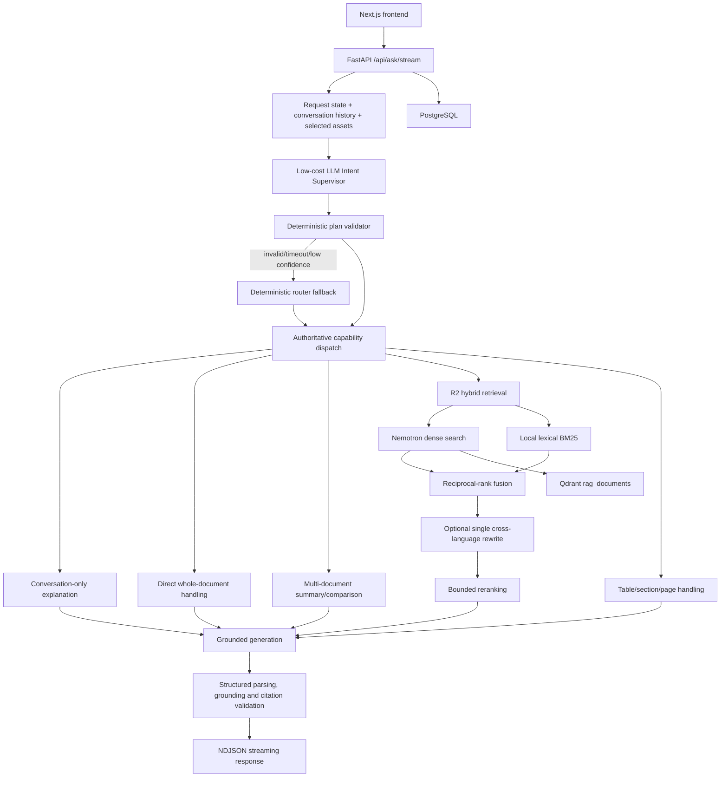

# RAG System

سامانه‌ای چندزبانه برای بارگذاری، پردازش و گفت‌وگوی مستند با اسناد خصوصی. رابط کاربری فارسی با Next.js، API با FastAPI، داده‌های کاربردی با PostgreSQL و بازیابی برداری با Qdrant پیاده‌سازی شده است.

> [!IMPORTANT]
> این مخزن یک محصول در حال توسعه است. مسیر اصلی RAG، تست‌ها و ابزارهای ارزیابی عملیاتی‌اند، اما استقرار عمومی همچنان به بازبینی امنیت، پشتیبان‌گیری، مانیتورینگ و hardening زیرساخت نیاز دارد.

## قابلیت‌های فعلی

- پرسش‌وپاسخ مستند از یک یا چند سند
- خلاصه جامع یک سند
- خلاصه جداگانه چند سند همراه با synthesis
- مقایسه چندسندی با استناد مستقل به هر منبع
- توضیح پاسخ قبلی بدون retrieval غیرضروری
- پرسش‌های جدولی، عددی و صفحه‌محور
- توضیح عبارت صریحاً نقل‌شده از سند
- retrieval میان‌زبانی فارسی/انگلیسی
- citation صفحه‌محور و اعتبارسنجی grounding
- history مکالمه، streaming و telemetry امن
- پردازش PDF، DOCX و TXT
- Development Gold Set، معیارهای deterministic و runnerهای evaluation

## معماری



### جریان درخواست

1. FastAPI session، conversation history و تمام `asset_ids` انتخاب‌شده را بارگذاری می‌کند.
2. Intent Supervisor پیام، خلاصه محدود history، وضعیت پاسخ قبلی و سندهای انتخاب‌شده را به‌صورت معنایی طبقه‌بندی می‌کند.
3. validator قطعی تعداد سند، نیاز به history، scope و قابلیت قابل اجرا را بررسی می‌کند.
4. JSON خراب، timeout یا confidence پایین به router قطعی موجود بازمی‌گردد.
5. یک orchestrator authoritative درخواست را به handler مناسب dispatch می‌کند.
6. پاسخ از pipeline موجود grounding، validation و citation عبور می‌کند.
7. وضعیت‌های واقعی اجرا و پاسخ نهایی از `/api/ask/stream` به‌صورت NDJSON ارسال می‌شوند.

## Intent Supervisor

Supervisor از مدل کم‌هزینه تنظیم‌شده با `RAG_SUPERVISOR_MODEL` استفاده می‌کند و فقط یک JSON محدود تولید می‌کند:

```json
{
  "intent": "multi_document_comparison",
  "scope": "multiple_documents",
  "uses_history": false,
  "requires_retrieval": true,
  "target_capability": "multi_document_comparison",
  "confidence": 0.96
}
```

خروجی مدل مستقیماً اجرا نمی‌شود. validator قواعد invariant مانند حداقل دو سند برای comparison، وجود پاسخ قبلی برای conversation explanation و ممنوعیت انتخاب مستقیم `no_answer` را اعمال می‌کند. نبود پاسخ فقط پس از بررسی evidence در handler مربوط مشخص می‌شود.

قابلیت‌های معنایی فعلی:

- `conversation_explanation`
- `single_document_summary`
- `multi_document_summary`
- `multi_document_comparison`
- `document_question_answering`
- `table_or_numeric_qa`
- `quoted_text_explanation`
- `section_lookup`
- `analytical_synthesis`
- `general_chat`
- `clarification_required`

## RAG و Retrieval

مسیر production از `RAG_RETRIEVAL_MODE=r2` استفاده می‌کند:

- dense retrieval با `nvidia/nemotron-3-embed-1b:free` از طریق OpenRouter
- lexical BM25 محلی روی payloadهای Qdrant در scope کاربر
- reciprocal-rank fusion
- حداکثر یک rewrite در mismatch زبانی
- یک rerank محدود
- تنوع evidence بر اساس واحدهای ساختاری سند

Qdrant با collection پیش‌فرض `rag_documents` vector backend اصلی است. PostgreSQL برای حساب‌ها، conversationها، asset metadata، خروجی‌ها و usage records استفاده می‌شود؛ pgvector مسیر اصلی retrieval نیست.

## یک‌سندی و چندسندی

- سند fit-safe مستقیماً با context کامل صفحه‌محور خلاصه می‌شود.
- سند بزرگ با خلاصه‌سازی section-aware محدود و synthesis نهایی پردازش می‌شود.
- خلاصه چندسندی تمام assetهای انتخاب‌شده را پوشش می‌دهد، هر سند را جداگانه معرفی می‌کند و synthesis کوتاه می‌سازد.
- comparison چندسندی موضوع، هدف، شباهت‌ها، تفاوت‌ها و محدودیت شواهد را فقط از همان منابع گزارش می‌کند.
- اگر context همه اسناد fit باشد، multi-document handler یک اجرای مستقیم دارد؛ در غیر این صورت هر سند به‌صورت محدود خلاصه و سپس synthesize می‌شود.

## Ingestion و پردازش سند

```text
Upload
→ format validation
→ PDF/DOCX/TXT extraction
→ optional OCR
→ canonical page-aware Markdown
→ title/document-type/section classification
→ heading-aware chunks with bounded overlap
→ embedding
→ Qdrant indexing
```

پردازش ساختار، metadata اداری را حذف نمی‌کند؛ آن را طبقه‌بندی و در summaryهای substantive کم‌اهمیت می‌کند. page provenance در chunkها و citationها حفظ می‌شود.

## Grounding و Citation

- context با evidence IDهای immutable به generator ارسال می‌شود.
- پاسخ provider باید contract ساختاریافته داشته باشد.
- parser مشترک JSONهای fenced، prefixed و truncation محدود را مدیریت می‌کند.
- citationها به source و صفحه فیزیکی render می‌شوند.
- ادعاهای عددی، quoted text و evidence IDها اعتبارسنجی می‌شوند.
- fallback تولید فقط با همان context و به‌صورت bounded انجام می‌شود.
- prompt خام، متن کامل سند، credential و provider body در telemetry ثبت نمی‌شوند.

## تکنولوژی‌ها

| لایه | فناوری |
|---|---|
| Frontend | Next.js 16، React 19، TypeScript |
| Backend | FastAPI، Uvicorn، Python |
| Orchestration | LangGraph + authoritative dispatcher |
| Application database | PostgreSQL، SQLAlchemy، Alembic |
| Vector database | Qdrant |
| Embedding | OpenRouter / `nvidia/nemotron-3-embed-1b:free` |
| Primary generator | `google/gemini-2.5-flash` |
| Fallback generator | `z-ai/glm-5.2` |
| Intent supervisor | `google/gemini-2.5-flash-lite` پیش‌فرض |
| Tests | pytest، Playwright، ESLint، Next.js build |

## نصب محلی

### پیش‌نیازها

- Python سازگار با dependencyهای pinned
- Node.js و npm
- Docker Desktop یا PostgreSQL و Qdrant قابل دسترس
- OpenRouter API key
- Tesseract و language pack فارسی فقط در صورت نیاز به OCR

### نصب backend

```powershell
cd D:\rag-system
python -m venv venv
.\venv\Scripts\Activate.ps1
pip install -r requirements.txt
```

برای evaluationهای اختیاری:

```powershell
pip install -r requirements-eval.txt
```

PyTorch را متناسب با CPU یا CUDA سیستم جداگانه نصب کنید.

### نصب frontend

```powershell
cd D:\rag-system\apps\web
npm install
```

### تنظیم environment

```powershell
cd D:\rag-system
Copy-Item .env.example .env
```

مقادیر secret را فقط داخل `.env` محلی یا secret manager قرار دهید. حداقل موارد لازم:

| متغیر | کاربرد |
|---|---|
| `FLASK_SECRET_KEY` یا `SESSION_SECRET_KEY` | امضای session |
| `DATABASE_URL` | اتصال PostgreSQL |
| `OPENROUTER_API_KEY` | embedding، supervisor، rerank و generation |
| `QDRANT_URL` | endpoint Qdrant |
| `QDRANT_COLLECTION` | collection production |
| `RAG_EMBEDDING_MODEL` | مدل embedding |
| `RAG_RETRIEVAL_MODE` | حالت retrieval، مقدار اصلی `r2` |
| `RAG_CROSS_LANGUAGE_REWRITE_ENABLED` | rewrite میان‌زبانی محدود |
| `RAG_PRIMARY_GENERATOR_MODEL` | generator اصلی |
| `RAG_FALLBACK_GENERATOR_MODEL` | fallback همان-context |
| `RAG_SUPERVISOR_MODEL` | مدل semantic intent |
| `RAG_SUPERVISOR_MIN_CONFIDENCE` | آستانه fallback به router قطعی |
| `ENABLE_LANGGRAPH_RAG` | wrapper orchestration production |
| `RERANKER_PROVIDER` / `RERANKER_MODEL` | reranking |
| `ENABLE_OCR_FALLBACK` | OCR برای PDFهای image-only |

فهرست کامل و defaultهای توسعه در [`.env.example`](.env.example) قرار دارد.

### زیرساخت و migration

```powershell
cd D:\rag-system
docker compose up -d
.\venv\Scripts\python.exe -m alembic upgrade head
```

### اجرای برنامه

```powershell
cd D:\rag-system
.\run-all.cmd
```

آدرس‌ها:

- Frontend: `http://127.0.0.1:3000`
- Backend: `http://127.0.0.1:5000`
- Qdrant dashboard: `http://127.0.0.1:6333/dashboard`

توقف:

```powershell
.\stop-all.cmd
```

## Evaluation و Testing

تست‌های عادی باید mock-backed و بدون provider call باشند:

```powershell
cd D:\rag-system
.\venv\Scripts\python.exe -m pip check
.\venv\Scripts\python.exe -m pytest -q

cd apps\web
npm run lint
npm run build
npm run test:e2e
```

E2Eهای provider-backed با environment gate جدا شده‌اند و در اجرای عادی skip می‌شوند. runnerهای `evaluation/runners/` ممکن است برای ارزیابی واقعی به provider دسترسی داشته باشند؛ پیش از اجرای آن‌ها budget و تنظیمات هر runner را بررسی کنید.

زیرساخت evaluation شامل این موارد است:

- Development Gold Set و conversation fixtures
- معیارهای retrieval استاندارد مانند Recall، MRR و nDCG
- معیارهای answer، summary، citation و Grounded Task Success
- calibration caseها و runnerهای deterministic
- reconciliation امن PostgreSQL/Qdrant
- production retrieval stage tracing
- held-out selection و tuning freeze

انتظارات Gold Set، qrelها و metric formulaها نباید برای بهبود ظاهری score تغییر داده شوند.

## ساختار مخزن

| مسیر | محتوا |
|---|---|
| `apps/web/` | رابط Next.js و Playwright E2E |
| `backend/app/api/` | endpointهای FastAPI |
| `backend/app/agents/` | Supervisor، router، LangGraph و handlerها |
| `backend/app/retrieval/` | hybrid retrieval و R2 |
| `backend/app/grounding/` | contract، citation و validation |
| `backend/app/vector/` | Qdrant و embedding/reranker adapters |
| `document_pipeline/` | extraction، normalization، OCR و chunking |
| `model_gateway/` | provider registry و adapters |
| `evaluation/` | Gold Set، metrics و runnerها |
| `tests/` | تست‌های backend، ingestion، retrieval و evaluation |
| `alembic/` | migrationهای PostgreSQL |
| `infra/qdrant/` | Qdrant Compose configuration |
| `docs/` | گزارش‌های معماری و quality checkpointها |
| `scripts/` | ابزارهای اجرا و نگهداری محلی |

## محدودیت‌های فعلی

- worker پردازش سند داخل application process اجرا می‌شود و هنوز یک worker مستقل مقیاس‌پذیر نیست.
- storage فایل‌ها محلی است و برای استقرار چند instance به object storage و سیاست backup نیاز دارد.
- کیفیت OCR به Tesseract و کیفیت PDF وابسته است.
- retrieval و generation به availability و quota سرویس provider وابسته‌اند.
- summaryهای بسیار بزرگ ممکن است چند فراخوانی bounded نیاز داشته باشند.
- evaluation موجود توسعه را پشتیبانی می‌کند، اما تضمین production-readiness یا پوشش همه دامنه‌ها نیست.
- payment، SMS، subscription enforcement، HTTPS و deployment policy باید جداگانه برای محیط مقصد اعتبارسنجی شوند.

## وضعیت توسعه و امنیت

مسیر production RAG، Supervisor، handlerهای یک‌سندی/چندسندی، citation validation و تست‌های regression پیاده‌سازی شده‌اند. با این حال، این وضعیت به معنی آماده‌بودن خودکار برای انتشار عمومی نیست.

موارد امنیتی ضروری:

- هرگز `.env`، API key، cookie، browser state، trace یا داده کاربر را commit نکنید.
- `storage/`، `tmp/`، PDFهای ارزیابی محلی و runtime data باید خارج از Git بمانند.
- secretها را برای هر محیط rotate و در secret manager نگهداری کنید.
- HTTPS، cookie policy، rate limits، upload limits و authorization را پیش از استقرار بازبینی کنید.
- PostgreSQL، Qdrant و فایل‌های کاربران را با سیاست backup و retention محافظت کنید.

برای جزئیات quality و تغییرات production به اسناد زیر مراجعه کنید:

- [`docs/rag-quality-baseline.md`](docs/rag-quality-baseline.md)
- [`docs/rag-production-path-fixes.md`](docs/rag-production-path-fixes.md)
- [`docs/rag-goal3-metric-optimization.md`](docs/rag-goal3-metric-optimization.md)
