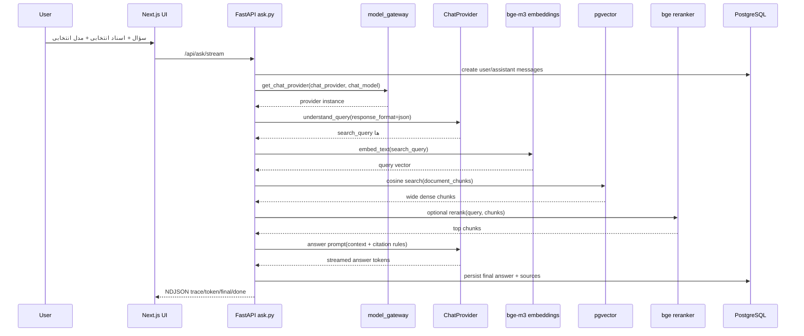

# Model interaction graph

این نمودار نشان می‌دهد مدل‌ها در پروژه چطور با هم تعامل می‌کنند. نکته‌ی اصلی این است که مدل‌ها مستقیم با هم حرف نمی‌زنند؛ کد backend آن‌ها را orchestrate می‌کند:

- `model_gateway` مدل چت را از بین `ollama`، `gemini` و `deepseek` انتخاب می‌کند.
- `bge-m3` متن سند و query کاربر را embedding می‌کند.
- `pgvector` نزدیک‌ترین chunkها را برمی‌گرداند.
- `bge-reranker-v2-m3`، اگر فعال باشد، نتایج dense را دوباره رتبه‌بندی می‌کند.
- همان ChatProvider انتخاب‌شده، هم برای فهم سؤال و هم برای تولید جواب نهایی استفاده می‌شود.
- در ingestion، LLM normalization اختیاری است و فقط label ساختار سند را تغییر می‌دهد، نه متن سند را.

```mermaid
flowchart LR
    user["کاربر"] --> web["Next.js UI<br/>ChatApp / Composer"]
    web --> nextProxy["Next API proxy<br/>/api/ask/stream"]
    nextProxy --> ask["FastAPI<br/>backend/app/api/routes/ask.py"]

    ask --> dbConv[("PostgreSQL<br/>conversations/messages")]
    ask --> mode{"mode"}
    ask --> gateway["model_gateway<br/>get_chat_provider(provider, model)"]

    gateway --> provider{"ChatProvider"}
    provider --> ollama["Ollama<br/>OLLAMA_MODEL / gemma3:12b"]
    provider --> gemini["Gemini<br/>GEMINI_MODEL"]
    provider --> deepseek["DeepSeek<br/>DEEPSEEK_MODEL"]

    mode --> free["free_chat"]
    mode --> grounded["grounded_chat"]
    mode --> tools["template_workflow / tools"]

    free --> freePrompt["rag._build_free_chat_messages"]
    freePrompt --> provider
    provider --> freeAnswer["stream/final answer"]

    grounded --> understand["rag.understand_query<br/>LLM JSON: user_question + search_query"]
    understand --> provider
    understand --> embedQuery["embed_text(search_query)<br/>SentenceTransformer bge-m3"]
    embedQuery --> vectorSearch["PGVectorStore.search<br/>cosine over document_chunks"]
    vectorSearch --> dense["wide dense results<br/>RETRIEVE_K"]
    dense --> rerank{"ENABLE_RERANKER?"}
    rerank -->|yes| cross["CrossEncoder<br/>bge-reranker-v2-m3"]
    rerank -->|no/fallback| topChunks["top chunks"]
    cross --> topChunks
    topChunks --> answerPrompt["rag._build_answer_messages<br/>context + citation rules"]
    answerPrompt --> provider
    provider --> groundedAnswer["grounded answer + sources"]

    tools --> runner["backend/app/services/tool_runner.py"]
    runner --> toolRetrieve["rag.retrieve<br/>tool-specific query/top_k"]
    toolRetrieve --> embedQuery
    runner --> toolPrompt["summary / exam / generic prompt"]
    toolPrompt --> provider
    provider --> toolAnswer["tool output<br/>markdown or exam JSON"]
    toolAnswer --> outputs[("PostgreSQL<br/>generated_outputs")]

    webUpload["Next.js Gallery UI"] --> upload["/api/gallery/upload"]
    upload --> assets[("PostgreSQL<br/>assets queue")]
    upload --> rawStorage[("storage/<user>/...<br/>original file")]
    assets --> worker["scan_worker<br/>background thread"]
    rawStorage --> worker
    worker --> normalize["document_pipeline.ingest<br/>TXT/PDF/DOCX normalize"]
    normalize --> ocr["Tesseract OCR<br/>PDF fallback"]
    normalize -. optional .-> llmNorm["llm_normalize<br/>Ollama structure relabeling"]
    llmNorm -. labels only .-> normalize
    normalize --> md[("normalized.md<br/>metadata.json")]
    normalize --> chunker["document_pipeline.chunker<br/>heading/page aware chunks"]
    chunker --> index["rag.index_chunks"]
    index --> addChunks["PGVectorStore.add_chunks"]
    addChunks --> embedDocs["embed_texts(chunks)<br/>SentenceTransformer bge-m3"]
    embedDocs --> chunksDb[("PostgreSQL + pgvector<br/>document_chunks")]
    vectorSearch --> chunksDb
    addChunks --> chunksDb

    grade["/api/outputs/{id}/grade"] --> grader["exam_grader.grade_exam"]
    grader --> gateway
```

## Grounded chat sequence

## مدل‌ها و نقش‌ها

| مدل/Provider | کجا استفاده می‌شود | نقش |
|---|---|---|
| `OllamaChatProvider` / `GeminiChatProvider` / `DeepSeekChatProvider` | `model_gateway`، `rag.py`، `tool_runner.py`، `exam_grader.py` | فهم سؤال، تولید پاسخ، تولید خروجی ابزارها، تصحیح تشریحی |
| `bge-m3` | `backend/app/vector/embeddings.py` | embedding برای chunkهای سند و query کاربر |
| `bge-reranker-v2-m3` | `rag.rerank` | rerank کردن نتایج dense قبل از تولید جواب |
| `Tesseract OCR` | `document_pipeline/ocr.py` via `ingest.normalize_pdf` | استخراج متن از PDFهای اسکن‌شده یا خراب |
| `LLM_NORMALIZATION_MODEL`، پیش‌فرض `gemma3:12b` | `document_pipeline/llm_normalize.py` | اصلاح label ساختاری بلوک‌های سند؛ متن تولیدی مدل وارد سند نمی‌شود |

